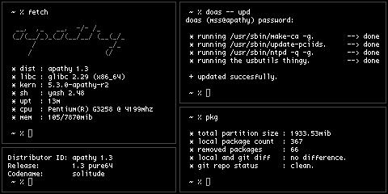
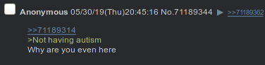

## msslinux pure64 1.2 "escapism"
mssLinux is a pure 64 bit gnu+linux distribution aiming to be minimalistic while not crippling the user's ability to smoothly do their computing. it is built from scratch by following the *linux from scratch 8.4* book as its base.



this is the third *release* of mssLinux, 1.0 being my first attempt to build an lfs system. it was fairly *bloated* as i didn't fine tune dependencies so i wanted to give it a second try, which gave birth to 1.1. 1.1 was supposed to be tidier, more minimalistic and also have multilib support for `steam` and `wine` but it got out of hand fairly quick due to me not being experienced enough with a multilib toolchain so that idea got scrapped, resulting in 1.2.

because it is intended to be the way i document my progress and keep everything in one place, this repository does not include a build script or an installer but if desired, following the lfs 8.4 book and then building the software listed under `pkg-management/packages.md` in the same order using the configs and patches under `pkg-management/build-configs` would result in an exact copy of this system.

#### about proprietary software under mssLinux
mssLinux in its current state is all free software including the kernel and the firmware, except the listed software below *(bear in mind that this is all i've filtered off of `parabola gnu/linux`'s blacklist so there might be more.)*:
```
[semifree] sdl		: contains a source file that doesn't mention modification.
[semifree] unzip	: contains a source file that doesn't mention modification.
[nonfree ] intel-ucode	: no modification, use restrictions.
[nonfree ] unrar	: (possible replacement) gna-unrar.
```



#### current package count and total system size:
```
$ [master][mssLinux]: pkg

 * total partition size	: 2500.27mib
 * local package count	: 376
 * removed packages	: 47

```
