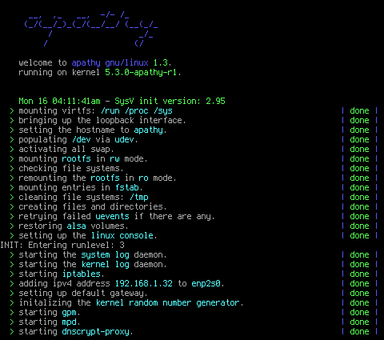

## apathy gnu/linux 1.3
apathy *(formerly known as mssLinux)* is a pure 64 bit gnu+linux distribution aiming to be minimalistic while not crippling the user's ability to smoothly do their computing. it was initially built from scratch by following the *linux from scratch 8.4* book as its base but as of apathy 1.3, the base is matching to `lfs-9.0-rc1` except for `glibc` and `openssl`.


this is the fourth *release* of apathy, 1.0 being my first attempt to build an lfs system. it was fairly *bloated* as i didn't fine tune dependencies so i wanted to give it a second try, which gave birth to 1.1. 1.1 was supposed to be tidier, more minimalistic and also have multilib support for `steam` and `wine` but it got out of hand fairly quick due to me not being experienced enough with a multilib toolchain so that idea got scrapped, resulting in 1.2. with the release of *linux from scratch 9.0-rc1*, i've bumped up apathy to 1.3 and rebuilt the base to match the versions in `lfs-9.0-rc1`. 

next to writing init scripts using `start-stop-daemon` from debian, i also rewrote the init scripts provided by the lfs/blfs books. made some functional changes, changes in style and removed bashisms so apathy's init system is not bound to bash in order to work.



because it is intended to be the way i document my progress and keep everything in one place, this repository does not include a build script or an installer but if desired, following the lfs 8.4 book and then building the software listed under `pkg-management/packages.md` in the same order using the configs and patches under `pkg-management/build-configs` would result in an exact copy of this system.

#### overview
```
toolchain:
 * gcc 9.2.0 (c,c++,objc,obj-c++)
 * binutils-2.32, glibc-2.29
 * linux 5.0 headers (deblobbed)

core userland:
 * util-linux-2.34, coreutils 8.31
 * sysklogd 1.5.1, sysvinit 2.96
 * eudev 3.2.8

languages:
 * python 2.7.15/3.7.2
 * ruby 2.6.4p104-libre
 * lua 5.3.5, luajit 2.0.5
 * perl-5.28.1

video/audio:
 * xorg (x11r7), mesa 19.2.0-rc4
 * alsa 1.1.8

shells:
 * bash 5.0, yash 2.48
```

#### patches used in the apathy kernel:
```
 * 5.3-deblob-gnu.patch				(fsf-la)
 * 5.3-bmq-100.patch				(alfred chen)
 * 5.3-cc_optimize_harder.patch			(zen-kernel)
 * 5.3-enable-link-security-by-default.patch	(gentoo-sources)
 * 5.3-fix-leaking-memory-tty.patch		(gen zhang)
 * 5.3-graysky2-gcc-9.1-cpu-opt.patch		(graysky2)
 * 5.3-ohgodohfuck-panic.patch			(mssx86)
 * 5.3-paolo-lucjan-bfq.patch			(paolo + lucjan)
 * 5.3-zen-futex-packports.patch		(zen-kernel)
 * 5.3-zen-tune.patch				(zen-kernel)
 * various clearlinux opt. patches		(intel)
```

#### about proprietary software under apathy
based on what i've filtered off of `parabola gnu/linux`' `blacklist.txt` multiple times, apathy in its current state is all free software, including the kernel and the firmware. next to running only free software, it also has libreified versions of `unzip`, `ruby` and `sdl`.

#### current package count and total system size:
```
~ > pkg

 * total partition size	: 1933.53mib
 * local package count	: 367
 * removed packages	: 66

```
